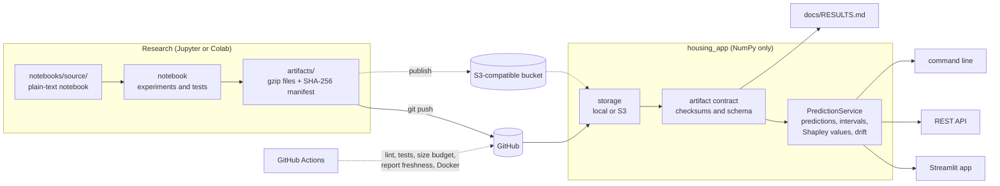

# California housing: a shallow neural network, studied carefully

[](../../actions/workflows/ci.yml)
[](pyproject.toml)
[](LICENSE)
[](https://4brqktfzqycjkedqp8myvm.streamlit.app/)

How much can a single hidden layer learn about house prices, and how far can its answers be trusted? This project
works through both questions on the 20,640 census block groups of the California Housing data (Pace & Barry, 1997).

The network is deliberately small, so the interest lies in the method. It is studied the way a lab runs an
experiment: one factor changes at a time, every comparison is repeated over five random seeds, every decision uses
validation data only, and the test set is opened once. After that, the model faces tests that tutorials usually skip.
Paired bootstrap comparisons check whether it really beats its rivals, and spatial cross-validation shows how it copes
with regions it has never seen. Conformal intervals put a measured error bar on every price, and exact Shapley values
explain any single prediction.

The trained model is served three ways, all through the same NumPy re-implementation of the network: an interactive
Streamlit dashboard, a REST API and a command line.

## Results at a glance

<!-- results:start -->
|  | result |
|---|---|
| Typical error (test MAE) | $34,929 (95% CI $33,614 to $36,319) |
| Variance explained (R²) | 0.801 |
| 90% prediction interval | ±$82,868, covered 91.0% of test block groups |
| Cost of predicting unseen regions | +20.7% MAE (spatial against random folds) |
| Artifacts fingerprint | `f0d7955fc3a6` |

Full evidence, figures and conclusions: [docs/RESULTS.md](docs/RESULTS.md)
<!-- results:end -->

Every output of the study, including all 27 figures, can be read in the [executed notebook](results/california_housing_shallow_nn_executed.ipynb)
or its [PDF copy](results/california_housing_shallow_nn_executed.pdf).

## What sets it apart

| | |
|---|---|
| **Controlled experiments** | width (16, 64, 256 units) and activation (ReLU, tanh, sigmoid) varied one at a time, everything else fixed |
| **Noise-aware decisions** | five seeds per configuration and a one-standard-error rule, so a lucky run cannot pick the model |
| **Test-set hygiene** | all tuning on validation data; the test set is evaluated exactly once |
| **Stronger testing** | paired bootstrap intervals, random against spatial cross-validation, slice tests and eight pre-registered hypotheses |
| **Calibrated uncertainty** | split-conformal intervals whose test-set coverage is measured, not assumed |
| **Explanations** | permutation importance, partial dependence and exact Shapley values for any single prediction |
| **Safe batch scoring** | input validation, out-of-distribution flags and drift statistics for uploaded data |
| **Verifiable results** | a SHA-256 manifest for every artifact, a fingerprint on every report and a CI check that the report is current |
| **A light repository** | compressed artifacts, stripped notebooks, SVG figures and a size budget enforced in CI |

## Try it

The **dashboard** has ten pages:

| Page | What you can do |
|---|---|
| Overview | the headline error with its interval, the decision trail, an error map on street tiles |
| Explore the data | the $500k price ceiling, maps coloured by any feature, a rotatable 3D hexagon map |
| Experiments | learning curves for every width, activation and seed, and an animated replay of training |
| Tuning | the random search as interactive parallel coordinates |
| Testing | bootstrap intervals at any level, paired comparisons, random against spatial folds, slice tests, interval coverage |
| Diagnostics | a parity heatmap, error by price decile, a lasso-selectable error map, feature importance |
| Try a block group | sliders with instant predictions, an interval, a Shapley waterfall and similar real block groups |
| Batch scoring and drift | upload a CSV or simulate a market shift; get intervals, drift statistics and a download |
| Beat the model | guess real block-group values against the network, with a shared leaderboard |
| How it works | the live architecture, integrity checks and storage status |

The **REST API** (`uvicorn api.main:app`, with interactive documentation at `/docs`):

```bash
curl -s localhost:8000/predict -H 'content-type: application/json' \
  -d '{"block_groups": [{"MedInc": 8.3, "Latitude": 37.88, "Longitude": -122.23}], "level": 0.9}'
```

The **command line**:

```bash
python -m housing_app predict --MedInc 8.3 --Latitude 37.88 --Longitude -122.23   # price with a 90% interval
python -m housing_app explain --MedInc 8.3 --Latitude 37.88 --Longitude -122.23   # Shapley breakdown
python -m housing_app score new_block_groups.csv -o scored.csv                     # batch scoring
python -m housing_app drift new_block_groups.csv                                   # drift against training data
python -m housing_app validate                                                     # checksums and self-check
```

Features you leave out take the training median, so a quick question needs only the inputs you care about.

## How it is built



Training and serving are separate: the notebook trains with TensorFlow and exports plain NumPy weights, so the
deployed app, the API and the command line need neither TensorFlow nor a GPU. The reasoning behind each design choice
is recorded as decision records in [docs/ARCHITECTURE.md](docs/ARCHITECTURE.md).

## Run it yourself

```bash
# clone the repository with the URL from GitHub's green Code button, then:
cd california-housing-shallow-nn
python -m venv .venv && source .venv/bin/activate

pip install -r requirements-train.txt          # TensorFlow, scikit-learn, JupyterLab
python scripts/build_notebook.py               # builds the notebook from its plain-text sources
cd notebooks && jupyter lab                    # run california_housing_shallow_nn.ipynb from top to bottom
cd .. && python -m housing_app report          # evidence report from the new artifacts

pip install -r requirements.txt
streamlit run app.py                           # dashboard on http://localhost:8501
```

A full training run fits about 70 small networks and takes 30 to 60 minutes on a laptop CPU. Setting
`QUICK_MODE = True` in the notebook's settings cell gives a five-minute smoke test, and finished runs are cached, so
re-running after an edit is quick. With Docker, `docker compose up --build` starts the dashboard on port 8501 and the
API on port 8000.

## Deploy

- **Streamlit Community Cloud.** Push the repository with its `artifacts/`, create an app with `app.py` as the main
  file and choose Python 3.11 or 3.12. To keep saved scenarios and game scores across restarts, paste a filled-in
  copy of `.streamlit/secrets.toml.example` into the app's secrets; any S3-compatible bucket works, including
  Cloudflare R2's free tier. Without a bucket the app saves to disk and says so on screen.
- **Any container host.** The two Dockerfiles build slim images that run as a non-root user with health checks.

## Testing and quality

- Unit tests cover the NumPy inference, both storage backends (S3 against an in-memory client), the artifact contract
  and its checksums, the statistics, conformal coverage, the Shapley properties, the drift statistics, the prediction
  service, the command line and the report generator.
- API contract tests exercise every endpoint, and a Streamlit `AppTest` renders all ten dashboard pages.
- Continuous integration runs on Python 3.11 and 3.12: lint, tests, the notebook build, the size budget, the report
  freshness check and both Docker builds, plus a weekly scheduled run; Dependabot keeps dependencies current.

The tests run against small synthetic fixtures written by the notebook's own export code, so they match the real
schema without TensorFlow. The app shows a warning banner whenever it loads them.

## Keeping the repository light

Artifacts are gzip-compressed with reproducible bytes and total around 1 MB to 2 MB. The notebook in `notebooks/` is
committed without outputs (a pre-commit hook strips them); the executed copy and its PDF live in `results/`, so every
output can be read on GitHub. Figures
are SVG with text kept as text, the pre-commit hook rejects files over 1.5 MB outside `results/`, and `scripts/check_size.py` enforces
per-folder budgets in CI.

## Documentation

| Document | Contents |
|---|---|
| [docs/METHODOLOGY.md](docs/METHODOLOGY.md) | the research questions, every design decision and its reason, the pre-registered hypotheses |
| [docs/EVALUATION.md](docs/EVALUATION.md) | how the model is tested, and the threats to validity |
| [docs/RESULTS.md](docs/RESULTS.md) | generated evidence: findings, hypothesis verdicts and the conclusion, all traceable to the artifacts |
| [docs/ARCHITECTURE.md](docs/ARCHITECTURE.md) | system design and architecture decision records |
| [docs/MODEL_CARD.md](docs/MODEL_CARD.md) | intended use, limits and metrics, following Mitchell et al. (2019) |
| [docs/DATASHEET.md](docs/DATASHEET.md) | the dataset's origin and quirks, following Gebru et al. (2021) |
| [docs/REFERENCES.md](docs/REFERENCES.md) | every source, in APA 7th edition |
| [CONTRIBUTING.md](CONTRIBUTING.md) | how to work on the project |

## Data, citation and license

The California Housing data come from the 1990 U.S. census, as distributed with scikit-learn (Pace & Barry, 1997;
Pedregosa et al., 2011). To cite this project, use GitHub's "Cite this repository" button, which reads
[CITATION.cff](CITATION.cff). The code is released under the [MIT License](LICENSE).

### References

Gebru, T., Morgenstern, J., Vecchione, B., Vaughan, J. W., Wallach, H., Daumé III, H., & Crawford, K. (2021). Datasheets for datasets. *Communications of the ACM, 64*(12), 86–92. https://doi.org/10.1145/3458723

Mitchell, M., Wu, S., Zaldivar, A., Barnes, P., Vasserman, L., Hutchinson, B., Spitzer, E., Raji, I. D., & Gebru, T. (2019). Model cards for model reporting. In *Proceedings of the Conference on Fairness, Accountability, and Transparency* (pp. 220–229). Association for Computing Machinery. https://doi.org/10.1145/3287560.3287596

Pace, R. K., & Barry, R. (1997). Sparse spatial autoregressions. *Statistics & Probability Letters, 33*(3), 291–297. https://doi.org/10.1016/S0167-7152(96)00140-X

Pedregosa, F., Varoquaux, G., Gramfort, A., Michel, V., Thirion, B., Grisel, O., Blondel, M., Prettenhofer, P., Weiss, R., Dubourg, V., Vanderplas, J., Passos, A., Cournapeau, D., Brucher, M., Perrot, M., & Duchesnay, É. (2011). Scikit-learn: Machine learning in Python. *Journal of Machine Learning Research, 12*, 2825–2830. https://jmlr.org/papers/v12/pedregosa11a.html
