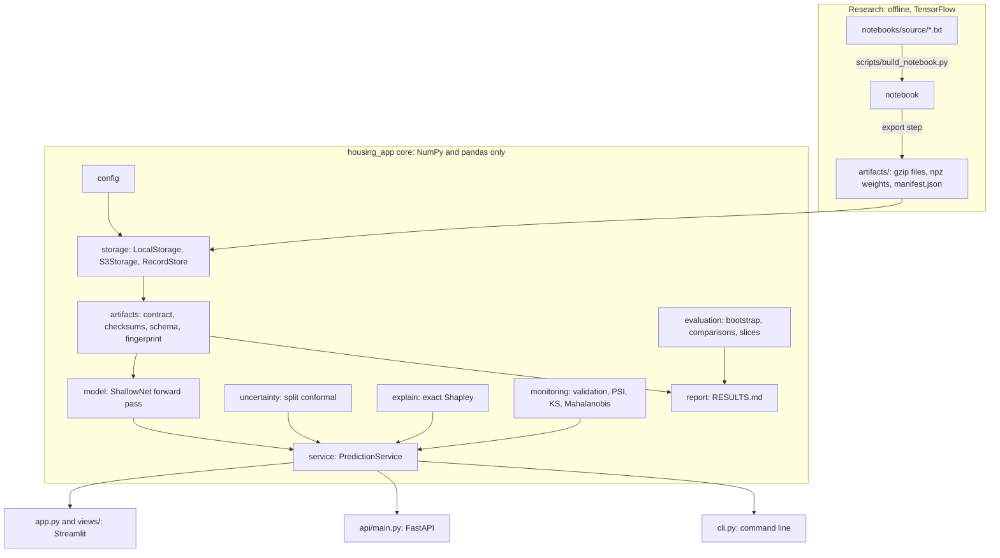

# Architecture and engineering decisions

The model is small, but the system around it is built the way a production machine-learning service should be.
Research and serving are separate, every interface runs through one tested core, artifacts are verified before they
are used, and the repository stays light enough to clone in seconds. This document explains the structure and records
the main design decisions, each with its context and its consequences.

## Goals and constraints

- **Free hosting.** The dashboard must run within the resource limits of Streamlit Community Cloud, which rules out
  heavy dependencies at serving time.
- **Verifiable results.** A reader must be able to check that every published number came from the committed artifacts.
- **Consistent answers.** The dashboard, the REST API and the command line must give identical predictions,
  intervals and explanations.
- **A light repository.** Cloning must be fast, and history must not fill up with notebook outputs or large binaries.
- **Reviewable change.** Every change, including changes to the research notebook, must be readable as a text diff.

## Overview

## Components

| Module | Responsibility |
|---|---|
| `housing_app/config.py` | settings from `HOUSING_*` environment variables, then Streamlit secrets; credentials hidden from `repr` |
| `housing_app/storage.py` | local and S3-compatible backends behind one interface; atomic local writes; append-only `RecordStore` |
| `housing_app/artifacts.py` | the file contract, gzip handling, SHA-256 verification, schema validation and the fingerprint |
| `housing_app/model.py` | the network's forward pass in NumPy, conformal intervals and the self-check against Keras |
| `housing_app/uncertainty.py`, `explain.py`, `monitoring.py`, `evaluation.py` | split conformal prediction, exact Shapley values, drift and out-of-distribution statistics, bootstrap testing |
| `housing_app/service.py` | `PredictionService`, the single entry point for every interface |
| `housing_app/report.py`, `cli.py` | the generated evidence report and the command line |
| `housing_app/charts.py`, `views/`, `app.py` | Plotly figures, the ten dashboard pages and the wiring between them |
| `api/main.py` | the REST API |

One dependency rule keeps the structure clean: the core imports only NumPy and pandas, and the presentation layers
depend on the core, never the other way round. The API's Docker image enforces this in practice, since it installs
neither Streamlit nor Plotly.

## Decision records

### ADR-001: Serve with NumPy, not TensorFlow

*Context.* TensorFlow is a large dependency that is slow to import, and free hosting has tight resource limits. The
trained network is two matrix multiplications and one activation function.

*Decision.* The notebook exports the weights, the scaler statistics and 25 reference predictions made by Keras. The
serving code re-implements the forward pass in NumPy and checks itself against those predictions, to within 1e-4.

*Consequences.* Cold starts take seconds and the container images stay small. The risk that the two implementations
diverge is controlled by the self-check, which runs in the tests and is visible in the app. Any new activation needs a
NumPy implementation, which the tests cover. Keeping a single, small serving path avoids the glue code and parallel
pipelines that Sculley et al. (2015) identify as a major source of hidden technical debt.

### ADR-002: A checksummed, versioned artifact contract

*Context.* The notebook and the app are separate programs. A stale, half-copied or hand-edited file could silently
change the results that the app shows.

*Decision.* The artifacts carry a schema version and a `manifest.json` with a SHA-256 checksum for every file
(National Institute of Standards and Technology, 2015). The loader verifies every checksum and every required field,
and it derives a short fingerprint from the checksums that the app, the API, the command line and the report all
display.

*Consequences.* Altered files are refused with their names, and every report is bound to exact bytes. Editing an
artifact by hand requires regenerating the manifest, which is deliberate friction.

### ADR-003: One storage interface, two backends

*Context.* Streamlit Community Cloud's disk is wiped when an app restarts, so user saves need somewhere durable.
S3-compatible object storage is cheap, standard and offered by several providers.

*Decision.* A small storage interface has two implementations, a local folder and an S3-compatible bucket, chosen in
the secrets file. `boto3` is imported only when S3 is used, and the S3 client can be injected, so tests use an
in-memory fake.

*Consequences.* Switching backends needs no code change, and the storage tests need neither network nor credentials.

### ADR-004: Append-only records for user data

*Context.* Several visitors may save scenarios or game scores at the same moment. Object stores have no transactions,
so rewriting a shared file would lose updates.

*Decision.* Every saved record is its own JSON object, named with a timestamp and a random suffix; readers list the
objects and sort them.

*Consequences.* There are no lost updates and no locks. Listing cost grows with the number of records, which is fine
at this scale with a 30-second cache; retention or deletion would need a separate job.

### ADR-005: One service behind three interfaces

*Context.* The dashboard, the API and the command line must give the same answers, and duplicating logic across them
is how inconsistencies creep in.

*Decision.* `PredictionService` owns validation, prediction, intervals, out-of-distribution flags, explanations and
drift. The interfaces only translate inputs and outputs.

*Consequences.* One test file covers the behaviour of all three interfaces, and the interfaces stay thin. This
separation of model logic from serving code reflects practice observed in large engineering organisations
(Amershi et al., 2019).

### ADR-006: The notebook as code

*Context.* The JSON format of notebooks makes diffs unreadable, and committed outputs bloat the history.

*Decision.* The notebook is generated from plain-text sources in which special comment lines separate the cells. A
pre-commit hook strips outputs, and optional rewording files ("editions") let the same sources produce differently
framed notebooks without forking them; personal editions stay out of git.

*Consequences.* Reviews happen on text. The sources must be rebuilt after editing, which continuous integration checks.

### ADR-007: Compressed artifacts and a size budget

*Context.* The artifacts include the learning curves of about 70 training runs and a 20,640-row dataset, and both
free hosting and fast clones reward small repositories.

*Decision.* Large artifacts are gzip-compressed with a fixed timestamp so that identical content gives identical
bytes. Floats are rounded to six significant digits, and the weights use compressed NumPy archives. A size budget per
folder runs in CI, and a pre-commit hook blocks files over 1.5 MB.

*Consequences.* The artifacts total around 1 to 2 MB, and reproducible bytes keep the checksums stable across
identical runs.

### ADR-008: A generated evidence report with a freshness check

*Context.* Hand-written results drift away from the data they describe.

*Decision.* `docs/RESULTS.md` is generated from the artifacts and embeds their fingerprint. CI fails if the report and
the committed artifacts disagree, and the README and the model card take their summaries from the same generator.

*Consequences.* A claim cannot quietly outlive its data. The narrative in the generated report is templated, so
nuanced interpretation belongs in the notebook and in [METHODOLOGY.md](METHODOLOGY.md).

## Failure modes

| Failure | What happens |
|---|---|
| artifacts missing | the app shows setup instructions, the API returns 503, the command line exits with status 2 |
| an artifact altered or truncated | the checksum check refuses it and names the file |
| bucket unreachable or credentials wrong | saves fall back to the server's disk, with a visible warning |
| uploaded CSV malformed | bad rows are flagged with reasons and skipped; nothing crashes |
| input far from the training data | the prediction is returned with an out-of-distribution flag and its distance |
| NumPy and Keras disagree | the self-check fails in the tests and shows on the app's status page |

## Security and privacy

Credentials live only in Streamlit secrets or environment variables; `.gitignore` excludes the secrets file, and the
settings object hides keys from logs. The data are neighbourhood aggregates with no personal information. Names that
users type are length-limited and rendered as text, never as HTML. The local storage backend refuses keys that would
escape its folder, the API validates every input range, and both container images run as an unprivileged user with
health checks.

## Performance

The trained bundle loads once per server process and reloads only when the manifest changes. An exact Shapley
explanation takes 128 vectorised forward passes, well under a millisecond. Batch scoring is vectorised and capped at
50,000 rows per upload, and bootstrap results are cached for each combination of settings.

## Testing strategy

The tests form a pyramid. The base is fast unit tests of the core, with no network and no TensorFlow. Above it sit
contract tests for the API, and above those a Streamlit `AppTest` that renders every page. At the top, CI-level checks
cover the notebook build, the size budget, report freshness and both Docker builds. This spread across data, model and
infrastructure follows the rubric proposed by Breck et al. (2017); [EVALUATION.md](EVALUATION.md) lists what each test
guarantees.

## References

Amershi, S., Begel, A., Bird, C., DeLine, R., Gall, H., Kamar, E., Nagappan, N., Nushi, B., & Zimmermann, T. (2019). Software engineering for machine learning: A case study. In *2019 IEEE/ACM 41st International Conference on Software Engineering: Software Engineering in Practice* (pp. 291–300). IEEE. https://doi.org/10.1109/ICSE-SEIP.2019.00042

Breck, E., Cai, S., Nielsen, E., Salib, M., & Sculley, D. (2017). The ML test score: A rubric for ML production readiness and technical debt reduction. In *2017 IEEE International Conference on Big Data* (pp. 1123–1132). IEEE. https://doi.org/10.1109/BigData.2017.8258038

National Institute of Standards and Technology. (2015). *Secure hash standard (SHS)* (FIPS PUB 180-4). U.S. Department of Commerce. https://doi.org/10.6028/NIST.FIPS.180-4

Sculley, D., Holt, G., Golovin, D., Davydov, E., Phillips, T., Ebner, D., Chaudhary, V., Young, M., Crespo, J.-F., & Dennison, D. (2015). Hidden technical debt in machine learning systems. In *Advances in Neural Information Processing Systems 28* (pp. 2503–2511). Curran Associates.
