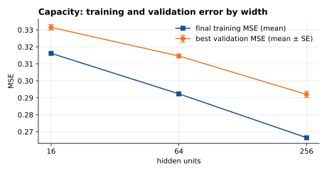
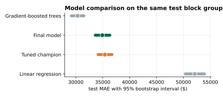
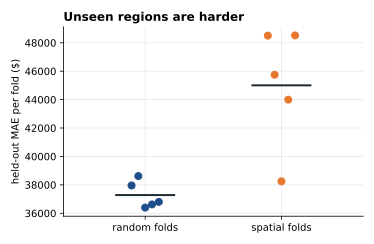
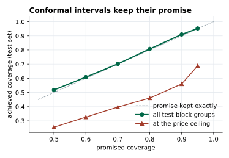

# Results and evidence

Generated by `python -m housing_app report` from the artifacts with fingerprint `f0d7955fc3a6` (checksums verified against the manifest), produced 2026-10-06 15:47 with TensorFlow 2.12.0 and Keras 2.12.0. Do not edit this file by hand: retrain, then regenerate it.

## Headline

| test-set metric | value | 95% bootstrap interval (2,000 resamples) |
|---|---|---|
| MAE | $34,929 | $33,614 to $36,319 |
| RMSE | $51,277 | $48,930 to $53,736 |
| R² | 0.801 | 0.782 to 0.818 |
| 90% conformal interval | ±$82,868 | covered 91.0% of test block groups |

## Pre-registered hypotheses

These hypotheses and their decision rules were written in [METHODOLOGY.md](METHODOLOGY.md) before the final training run. The verdicts below are computed from the artifacts, not chosen.

|  | hypothesis | evidence | verdict |
|---|---|---|---|
| H1 | 16 hidden units underfit relative to 64 | 0.3314 against 0.3146 (SE 0.0012) | supported |
| H2 | Sigmoid converges more slowly than ReLU and tanh | epochs to the common target: sigmoid never, ReLU 36, tanh never; tanh never reached it either, so that comparison is undecided | partly supported |
| H3 | The selected model's validation error is optimistic | validation MSE 0.2918, test MSE 0.2629 | not supported |
| H4 | Unseen regions are harder than random folds suggest | spatial-fold MAE $45,004, random-fold MAE $37,280 | supported |
| H5 | The network beats linear regression | MAE difference -$17,175 (95% interval -$18,521 to -$15,822) | supported |
| H6 | Gradient-boosted trees are at least as accurate | MAE difference $4,605 (95% interval $3,797 to $5,415) | supported |
| H7 | 90% conformal intervals keep their promise | test coverage 91.0% | supported |
| H8 | Errors are larger at the price ceiling | MAE $83,323 at the ceiling, $32,620 below it | supported |

## Findings

### 1. Capacity

Training loss fell steadily as the hidden layer widened (mean final training MSE 0.3162 at 16 units, 0.2665 at 256). 256 units also reached the lowest mean best validation MSE over five seeds (0.2919 ± 0.0018 SE), clear of the next width by more than one standard error.

| Hidden units | best validation MSE (mean ± SE) | best epoch (mean) | final training MSE (mean) |
|---|---|---|---|
| 16 | 0.3314 ± 0.0016 | 98 | 0.3162 |
| 64 | 0.3146 ± 0.0012 | 98 | 0.2923 |
| 256 | 0.2919 ± 0.0018 | 98 | 0.2665 |

### 2. Activation

ReLU reached the lowest mean best validation MSE (0.2919), ahead of tanh (0.3280) and sigmoid (0.3586). ReLU was the fastest to reach the common target (36 epochs), and tanh and sigmoid never reached it within the budget. Saturation was rare after training (1.2% of sigmoid and 0.9% of tanh pre-activations sat on the flat parts of their curves), so it does not explain their slower learning; their small, nearly linear gradients near zero do (LeCun et al., 2012). The selected activation was ReLU.

| Activation | mean best validation MSE |
|---|---|
| ReLU | 0.2919 |
| tanh | 0.3280 |
| sigmoid | 0.3586 |

### 3. Model comparison

Scored on the same resampled test block groups (a paired bootstrap; Efron & Tibshirani, 1993), the final network beat the tuned champion by $473 (95% interval $19 to $932); it beat linear regression by $17,175 (95% interval $15,822 to $18,521); it lost to gradient-boosted trees by $4,605 (95% interval $3,797 to $5,415).

| model | test MAE | 95% bootstrap interval |
|---|---|---|
| Final model | $34,929 | $33,614 to $36,319 |
| Tuned champion | $35,402 | $34,140 to $36,721 |
| Linear regression | $52,104 | $50,363 to $53,919 |
| Gradient-boosted trees | $30,324 | $29,167 to $31,513 |

### 4. Tuning beyond the core protocol

The random search (25 trials) favoured 256 ReLU units with learning rate 0.000605, L2 0.0001, no dropout and log-transformed features. Its validation MSE was 0.2875, 1.5% below the reference model's 0.2918. Part of any validation gain is selection bias from picking the best of many trials (Cawley & Talbot, 2010), so the test set, which played no part in the search, is the fair judge: there the champion's MAE was $35,402 against $34,929 for the reference model, so the validation gain did not carry over to typical error, although the champion's test MSE was lower (0.2570 against 0.2629).

### 5. Generalisation to unseen regions

Random 5-fold cross-validation of the final configuration gave an MAE of $37,280 (SD $961 across folds). Holding out whole regions gave $45,004 (SD $4,238), a change of +20.7%. Pricing places the network has never seen is clearly harder, so a random-split score is an optimistic guide to performance in a new region (Roberts et al., 2017).

### 6. Calibrated uncertainty

A 90% split-conformal interval is ±$82,868 around every prediction. On the test set it covered 91.0% of block groups against a promise of 90.0% (Lei et al., 2018), so the promise held. Coverage was 56.0% for block groups at the $500,000 ceiling and 92.7% below it: a single width fits everyone, so it is too narrow exactly where the errors are largest.

### 7. What the network relies on

Shuffling one feature at a time on the test set raised the MSE most for Latitude (+950%), Longitude (+843%), AveRooms (+324%). These scores measure what the model relies on, not causal effects.

### 8. Where the model is weakest

- nearest major city: weakest slice *San Francisco*, MAE $40,988 (95% interval $37,664 to $44,699) on 458 block groups
- income band (MedInc quintile): weakest slice *top 20%*, MAE $44,366 (95% interval $41,458 to $47,363) on 619 block groups
- input extremity: weakest slice *an input beyond 4 SD*, MAE $38,382 (95% interval $28,087 to $50,526) on 59 block groups
- price ceiling: MAE $83,323 for capped block groups against $32,620 below the cap. The true value of a capped block group is only known to be at least $500,000, so its recorded error understates the real one (Tobin, 1958).

## Conclusion

A one-hidden-layer network with 256 ReLU units prices an unseen 1990 California block group with a typical error of $34,929 (95% interval $33,614 to $36,319) and explains 80% of the variance in median house value. It clearly improves on linear regression, which shows the hidden layer is earning its keep. Gradient-boosted trees remain stronger, as they usually are on tabular data of this size. Its error grows by 20.7% when whole regions are held out, so it fills gaps on a known map better than it would price a new one. Its 90% conformal intervals covered 91.0% of test block groups, so the stated uncertainty can be taken at face value, except near the price ceiling. Six of the eight pre-registered hypotheses were supported, one only in part, and one was not; the table above gives the evidence for each. Contrary to H3, the test error came out below the validation error. Every random cross-validation fold had a higher MAE than the test set (mean $37,280), which points to a slightly easy test sample rather than an unbiased validation score. These statements rest on a test set used once, on choices made with validation data only, on repeated runs over five seeds, and on the artifacts with fingerprint `f0d7955fc3a6`; each number above can be recomputed from them.

## Limitations

The data describe 20,640 census block groups in 1990, so the model prices neighbourhoods as they were then, not homes today, and reading its group-level patterns as statements about individual houses would be an ecological fallacy (Robinson, 1950). 4.8% of block groups are top-coded at $500,000. The random split shares neighbourhoods between training and test sets, which flatters the headline score relative to a new region. The validation set chose the configuration and calibrated the intervals, so both are slightly optimistic. All results come from one dataset and one model family by design; they say nothing about deeper networks or other markets.

## How to verify

- `python -m housing_app validate` re-checks the SHA-256 checksums in `artifacts/manifest.json` and the NumPy-against-Keras self-check.
- `python -m housing_app report --check` confirms that this file was generated from the committed artifacts.
- The executed notebook reproduces every number here from a fixed seed.

## References

Cawley, G. C., & Talbot, N. L. C. (2010). On over-fitting in model selection and subsequent selection bias in performance evaluation. *Journal of Machine Learning Research, 11*, 2079–2107. https://jmlr.org/papers/v11/cawley10a.html

Efron, B., & Tibshirani, R. J. (1993). *An introduction to the bootstrap*. Chapman & Hall/CRC. https://doi.org/10.1201/9780429246593

Glorot, X., & Bengio, Y. (2010). Understanding the difficulty of training deep feedforward neural networks. In *Proceedings of the Thirteenth International Conference on Artificial Intelligence and Statistics* (pp. 249–256). PMLR. https://proceedings.mlr.press/v9/glorot10a.html

Grinsztajn, L., Oyallon, E., & Varoquaux, G. (2022). Why do tree-based models still outperform deep learning on typical tabular data? In *Advances in Neural Information Processing Systems 35* (pp. 507–520). Curran Associates. https://proceedings.neurips.cc/paper_files/paper/2022/hash/0378c7692da36807bdec87ab043cdadc-Abstract-Datasets_and_Benchmarks.html

Hastie, T., Tibshirani, R., & Friedman, J. (2009). *The elements of statistical learning: Data mining, inference, and prediction* (2nd ed.). Springer. https://doi.org/10.1007/978-0-387-84858-7

Lei, J., G'Sell, M., Rinaldo, A., Tibshirani, R. J., & Wasserman, L. (2018). Distribution-free predictive inference for regression. *Journal of the American Statistical Association, 113*(523), 1094–1111. https://doi.org/10.1080/01621459.2017.1307116

Roberts, D. R., Bahn, V., Ciuti, S., Boyce, M. S., Elith, J., Guillera-Arroita, G., Hauenstein, S., Lahoz-Monfort, J. J., Schröder, B., Thuiller, W., Warton, D. I., Wintle, B. A., Hartig, F., & Dormann, C. F. (2017). Cross-validation strategies for data with temporal, spatial, hierarchical, or phylogenetic structure. *Ecography, 40*(8), 913–929. https://doi.org/10.1111/ecog.02881

Robinson, W. S. (1950). Ecological correlations and the behavior of individuals. *American Sociological Review, 15*(3), 351–357. https://doi.org/10.2307/2087176

Tobin, J. (1958). Estimation of relationships for limited dependent variables. *Econometrica, 26*(1), 24–36. https://doi.org/10.2307/1907382
